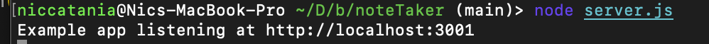
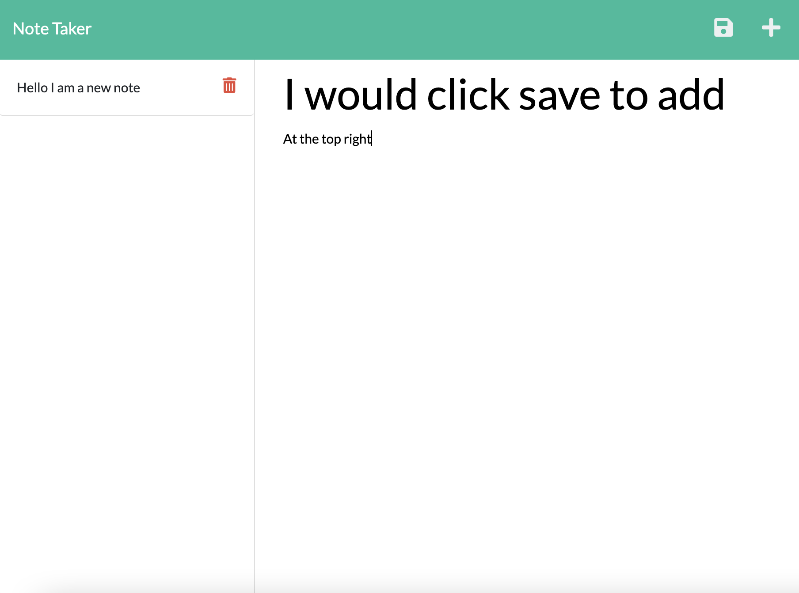

# Note Taker

# Deployed Heroku Link
 https://morning-peak-43787.herokuapp.com/

  ### Table of Contents  

  [Description](#Description)

  [Usage](#Usage)  

  [Contributors](#Contributors) 

  [License](#License) 

  [Questions](#Questions)  
  
  [Description](#Description) 
  

## Description:
This application connects a front-end with the back-end server. It writes, and saves notes using JS and express routes.
## Installation:
Download code. Run npm I to install the dependencies. run node server.js to start up the local server.
## Usage:
This project uses HTML, Javascript, Node.js, Express, and Heroku.

## Contributors:
Nic Catania
## License
This project uses the MIT license.
## Questions
If you have any questions please contact me through github or email.
Github: https://github.com/Niccatania

Email: niccatania6@gmail.com
